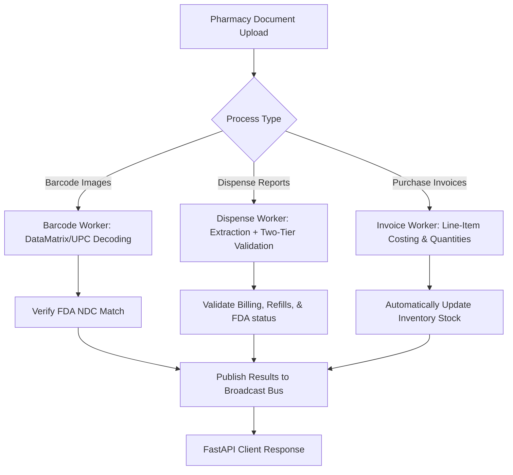

# Queue RX System Overview

This document provides a comprehensive overview of the **Queue RX** product, its backend architectural style, design patterns, and overall system goals. It is designed to help engineers, stakeholders, and operators understand how the system functions, its core architectural invariants, and the rationale behind its key components.

---

## 1. Product Description & Features

**Queue RX** is a production-ready pharmacy queue, inventory, and document validation management platform. It solves the critical operational problems of manual data entry, billing inaccuracies, drug safety compliance, and running inventory management in retail medical stores.

The system processes three primary types of unstructured pharmacy documents (PDF, Excel, and image formats) and performs automated analyses:



### Core Features

1. **Decoupled Document Processing Pipeline**: Decoupled ingestion of unstructured/semi-structured reports via Kafka message topics. The system reads documents, extracts structured data using OCR/LLM models, and returns validation reports.
2. **Two-Tier Validation Engine**:
   * **Tier 1 (Instant/Local)**: Executes quick checks without network dependencies. Catches data shape anomalies, duplicate billing combinations (same patient, drug, and insurance), unpaid lines, and refills remaining.
   * **Tier 2 (External/FDA)**: Queries the FDA Drug NDC Directory (cached locally for performance). Detects discontinued drugs, drug name/NDC mismatches, and fractional quantities for unit-of-use packages (e.g., inhalers, prefilled pens).
3. **Automated Inventory Tracking**: Adjusts stock levels automatically:
   * Persisting a validated purchase invoice (`POST /invoices`) adds quantities (`+qty`) to `medicine_inventory`.
   * Persisting a validated dispense report (`POST /dispenses`) subtracts quantities (`-qty`) from `medicine_inventory`.
4. **Real-Time DataMatrix & Barcode Verification**: Decodes package details (GTIN, serial numbers, lots, and expiration dates) to verify products against FDA records before they enter the pharmacy stock.
5. **Real-Time Live Monitoring Dashboard**: An embedded operations console served under `/dashboard` showing live execution logs, message bus activities, and background worker statuses.

---

## 2. Backend Style & Architecture

The backend is written in Python (≥ 3.10) using **FastAPI** for HTTP serving, **SQLAlchemy (Async)** for database operations, and **Apache Kafka** for background message routing and queue orchestration.

```
                      ┌──────────────────────┐
                      │    FastAPI Client    │
                      └──────────┬───────────┘
                                 │ HTTP / REST
                                 ▼
                      ┌──────────────────────┐
                      │   FastAPI Web App   │◄───────┐
                      │    (main.py)         │       │
                      └────┬────────────▲────┘       │ Log
                           │            │            │ Stream
                     Kafka │ Publish    │ Result Bus │ (SSE)
                    Topics │            │ Broadcast  │
                           ▼            │            │
                     ┌───────────┐      │            │
                     │   Kafka   ├──────┴────────────┼───┐
                     └─────┬─────┘                   │   │
                           │                         │   │
            ┌──────────────┼──────────────┐          │   │
            ▼              ▼              ▼          │   │
      ┌───────────┐  ┌───────────┐  ┌───────────┐    │   │
      │  Invoice  │  │ Dispense  │  │  Barcode  │    │   │
      │  Worker   │  │  Worker   │  │  Worker   │    │   │
      └─────┬─────┘  └─────┬─────┘  └─────┬─────┘    │   │
            │              │              │          │   │
            └──────────────┼──────────────┘          │   │
                           ▼                         ▼   ▼
                     ┌───────────┐             ┌───────────┐
                     │ MySQL DB  │             │ Log Buffer│
                     └───────────┘             └───────────┘
```

### Key Architectural Patterns

#### A. The Aggregate Router Pattern
Instead of registering decorators scattershot across modules, core domain APIs (Auth, User, and Pharmacy) are aggregated inside [routes/__init__.py](file:///d:/QueueRX/fastapi-backend/routes/__init__.py).
* **Benefits**: Centralizes route orchestration, forces strict OpenAPI documentation (summaries, descriptions, response models, and operation IDs), and separates controller declarations from implementation.
* Standalone feature routes (e.g. `documents`, `monitor`, `inventory`) use conventional `@router` decorators.

#### B. Service-Repository Separation
API handlers in `routes/` manage only the HTTP interface, model validation, and response serialization. All business logic, database transaction scoping, and external client lookups are encapsulated within the `services/` layer (e.g. `services/user_service.py` and `services/inventory_service.py`).

#### C. Async-Wait Kafka Pipeline (Synchronous-Feeling Uploads)
Because OCR and LLM-based extraction takes 5–30 seconds, traditional blocking HTTP requests are impractical. Queue RX resolves this using an async-wait pattern:
1. **Request Ingestion**: The client uploads a file to `POST /documents/process` ([routes/documents.py](file:///d:/QueueRX/fastapi-backend/routes/documents.py)).
2. **State Transition**: A state record is written to the `documents` table with status `QUEUED`.
3. **Pre-Register Bus Listening**: The API instance pre-registers an `asyncio.Future` with the in-memory `result_bus` ([kafka_infra/result_bus.py](file:///d:/QueueRX/fastapi-backend/kafka_infra/result_bus.py)) using the file's unique `doc_key`.
4. **Queue Job**: The job is published to the Kafka topic (e.g., `invoice-processing`).
5. **Await Completion**: The API instance halts and awaits the future's completion (`asyncio.wait_for` up to 180 seconds).
6. **Result Broadcast**: Once the worker completes processing, it publishes the outcome to the shared `processing-results` topic.
7. **Broadcast Bus Routing**: Every API instance consumes `processing-results` in its own broadcast consumer group (`api-results-<uuid>`). The instance holding the awaiting future resolves it, delivering a fast, synchronous response to the user.
8. **Fallback Mode**: If processing exceeds the timeout, the API returns a `202 Accepted` response with the `doc_key`, and the frontend gracefully falls back to polling `GET /documents/{doc_key}`.

#### D. Kafka Topic Isolation & Guarantees
Each processing flow implements a dedicated set of topics dynamically derived from the process type (defined in `kafka_infra/topics.py`):
* `<type>-processing`: Main worker queue.
* `<type>-retry`: Delayed queue for exponential backoff retries.
* `<type>-dlq`: Dead Letter Queue for terminal message failure analysis.
* **Manual Offset Commits**: Workers run with `enable_auto_commit=False` ([kafka_worker/base_worker.py](file:///d:/QueueRX/fastapi-backend/kafka_worker/base_worker.py)). The offsets are committed **only after** the result is stored in the database and published, securing an *at-least-once* execution guarantee.

#### E. Strict PHI/PII Protection
To maintain compliance with healthcare data regulations (such as HIPAA), raw patient names, phones, and addresses are restricted:
* They are saved exclusively in the `dispenses` database table.
* They are **never** logged to stderr, log files, or piped to the monitoring dashboard.
* For grouping operations (e.g. tracking duplicate bills across multiple prescriptions), the system generates a deterministic, anonymous 16-character SHA-1 identifier called the `patient_key` inside [services/validation/patient_key.py](file:///d:/QueueRX/fastapi-backend/services/validation/patient_key.py).

#### F. In-Memory Ring Buffer Logging
Live monitoring uses [core/logging.py](file:///d:/QueueRX/fastapi-backend/core/logging.py) to remove default handlers and configure:
1. Standard Error (stderr) console outputs.
2. Timestamped files under the `logs/` directory.
3. An in-memory circular buffer [core/log_buffer.py](file:///d:/QueueRX/fastapi-backend/core/log_buffer.py) that acts as a log stream source for the dashboard's Server-Sent Events (SSE) router ([routes/monitor.py](file:///d:/QueueRX/fastapi-backend/routes/monitor.py)).

---

## 3. Goals of the System

The development of Queue RX centers on several key business and engineering objectives:

* **High-Accuracy Automation**: Eliminate manual data-entry errors by utilizing advanced document parse utilities, OCR, and AI extraction, freeing pharmacy workers to focus on patients.
* **Data Integrity & Consistency**: Prevent stock discrepancies by ensuring that all inventory movements are tracked back to a validated document (invoices for addition, dispense logs for subtraction).
* **Financial Verification**: Reconcile claims and catch plan-level double-billing or unpaid insurance lines, which protects the pharmacy against revenue leaks and fraud.
* **Regulatory Compliance**: Shield patient identity through structural hashing of PHI, and verify drug status against updated FDA listings to ensure no discontinued or recalled products are dispensed.
* **Scalable Throughput**: Leverage a containerized Kafka queue structure to handle massive surges in document uploads by scaling workers independently without degrading API response times.
* **Operational Visibility**: Offer developers and pharmacy admins clear, real-time insights into system health, log streams, and background worker queues.
